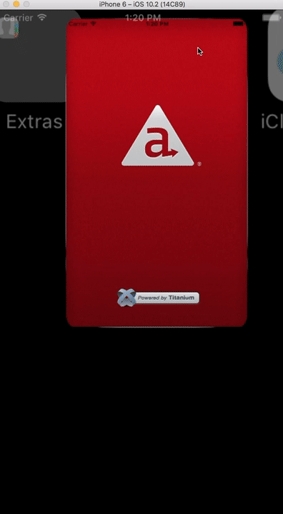
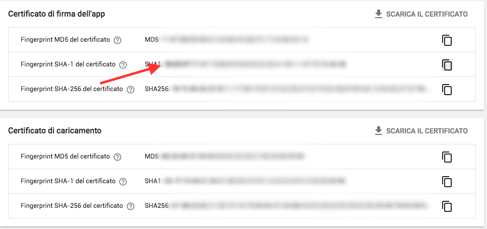

# Google SignIn SDK in Appcelerator Titanium

   
   
## Summary

Ti.GoogleSignIn is an open-source project to support the Google SignIn SDK in Appcelerator's Titanium.

## Requirements

  * Titanium SDK 9.2.0+
  * Ti.PlayServices (Android)

### Download

[Releases page](https://github.com/hansemannn/titanium-google-signin/releases)

### Setup

#### iOS Setup

```
Add the following URL types to your plist section of the tiapp.xml:
```xml
<key>CFBundleURLTypes</key>
<array>
    <dict>
        <key>CFBundleTypeRole</key>
        <string>Editor</string>
        <key>CFBundleURLName</key>
        <string>google</string>
        <key>CFBundleURLSchemes</key>
        <array>
            <!-- Example: com.googleusercontent.apps.123456789-xxxxxxxx -->
            <string>YOUR_REVERSE_CLIENT_ID</string>
        </array>
    </dict>
</array>
```

#### Android Setup

##### Permissions in manifest

```xml
<uses-permission android:name="android.permission.INTERNET" />
<uses-permission android:name="android.permission.GET_ACCOUNTS" />
<uses-permission android:name="android.permission.USE_CREDENTIALS" />
```

##### ⚠️ PLEASE NOTE!

**You will need to use the Web ClientID from Google instead of a Android one.**
   
##### Obtaining a SHA-1 with Titanium

In order to use Google Sign In in your app you will need to provide an SHA-1 certificate fingerprint for Google Console.
You will need to provide a debug and a distribution SHA-1 fingerprint for your app. On Titanium, the debug SHA-1
has to be generated from the `dev_keystore` file from your Titanium SDK android folder located at "mobilesdk/<platform>/<sdk_version>/android/dev_keystore".
On macOS for example it would rely on: "~/Library/Application\ Support/Titanium/mobilesdk/osx/9.3.0.GA/android/dev_keystore".   
And an command line example for it would be:   
```
keytool -list -v -keystore ~/Library/Application\ Support/Titanium/mobilesdk/osx/9.3.0.GA/android/dev_keystore
```   

You can follow same instructions used to configure a map in your Android app from [Appcelerator Docs](http://docs.appcelerator.com/platform/latest/#!/guide/Google_Maps_v2_for_Android-section-src-36739898_GoogleMapsv2forAndroid-ObtainandAddaGoogleAPIKey).   

This repo also [includes a video](https://github.com/AppWerft/Ti.GoogleSignIn/blob/master/example/How%20to%20create%20Android%20keys.mov) on how to create an Android app on Firebase and Google Developers Console to better explain the process.   
As Appcelerator's documentation recommends, when submitting your app to Google Play Store you will need to create a production .keystore file, so don't forget to create another SHA-1 for this key and remember to add it also as another "fingerprint" on Firebase.   
Note that some users have reported problems when submitting new apps to the Play Store, where the Google Login stop working on production. A solution found was to get another SHA-1 fingerprint from the Google Play app's dashboard and add this fingerprint to Firebase.
These fingerprints could be found on your Google Play Console, under the "Release Management" menu on the left and then on "App signing".
Here is an example on how it looks like:   
   


Initialize the module by setting the Google SignIn API key you can get from the Google API Console.
```javascript
var Google = require('ti.googlesignin');
Google.initialize({
    clientID: '<client-id>',

    // Optional properties:
    serverClientID: '<server-client-id>',
    scopes: ['https://www.googleapis.com/auth/plus.login'], // See https://developers.google.com/identity/protocols/googlescopes for more
    language: 'de', // Or 'de-DE', 'en-US', etc.
    loginHint: 'Titanium rocks!',
    hostedDomain: 'https://my-hosted-domain.com',
    shouldFetchBasicProfile: false, // Default: true
    openIDRealm: 'my-openID-realm',
});
```
#### Methods
- [x] `signIn()`
- [x] `signInSilently()`
- [x] `signOut()`
- [x] `disconnect()`
- [x] `hasAuthInKeychain` -> Boolean
- [x] `currentUserImageURLWithSize(size)` -> String

#### Properties
* [x] `language` (String, `get|set`)
* [x] `currentUser` (Dictionary, `get`)
    * `id` (String) 
    * `scopes` (Array<String>) 
    * `serverAuthCode` (String) 
    * `hostedDomain` (String) 
    * `profile` (Dictionary)
        * `name` (String)
        * `givenName` (String)
        * `familyName` (String)
        * `email` (String)
        * `hasImage` (Boolean)
    * `authentication` (Dictionary)
        * `clientID` (String)
        * `accessToken` (String)
        * `accessTokenExpirationDate` (Date)
        * `refreshToken` (String)
        * `idToken` (String)
        * `idTokenExpirationDate` (Date)

#### Events
- [x] `login`
- [x] `logout`
- [x] `cancel`
- [x] `load`
- [x] `open`
- [x] `close`

The `login`- and `logout` events include a `success` flag as well as a `user` key that includes the following user-infos:
```
id, scopes, serverAuthCode, hostedDomain, profile, authentication
```

### Build
If you want to build the module from the source, you need to check some things beforehand:
- Set the `TITANIUM_SDK_VERSION` inside the `ios/titanium.xcconfig` file to the Ti.SDK version you want to build with.
- Build the project with `appc run -p ios --build-only`
- Check the [releases tab](https://github.com/hansemannn/titanium-google-signin/releases) for stable pre-packaged versions of the module

### Example
For a basic example, check the demo in `example/app.js`. For a full sample-app, check out the demo in `example/sample-app`.

### Author
Hans Knoechel ([@hansemannnn](https://twitter.com/hansemannnn) / [Web](http://hans-knoechel.de))

### License
Apache 2.0

### Contributing
Code contributions are greatly appreciated, please submit a new [pull request](https://github.com/hansemannn/titanium-google-signin/pull/new/master)!
